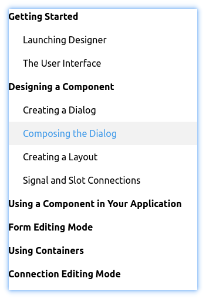

a simple Material TreeView with ripple effect based on Qt.   
inspired by https://github.com/laserpants/qt-material-widgets and https://doc.qt.io/qt-5/qtwidgets-itemviews-editabletreemodel-example.html  

